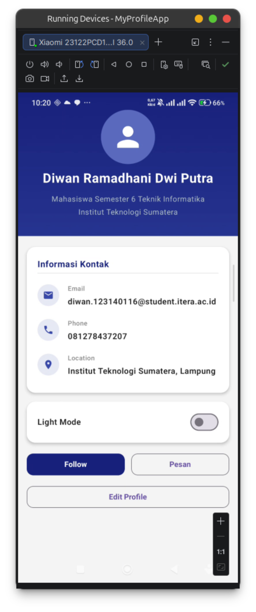
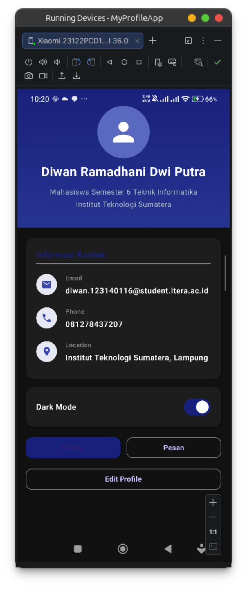
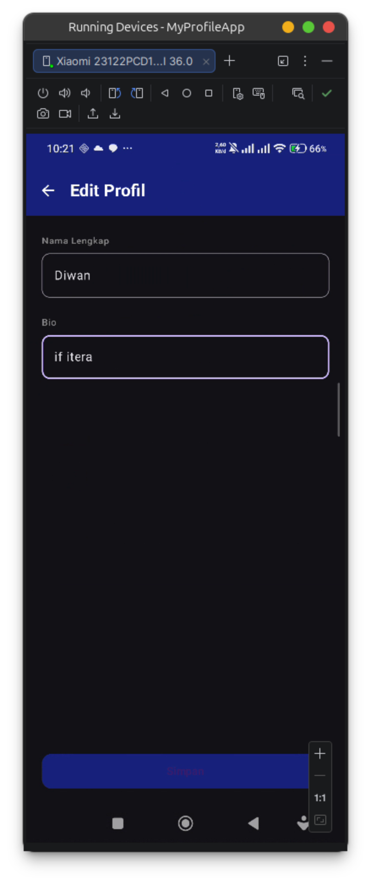
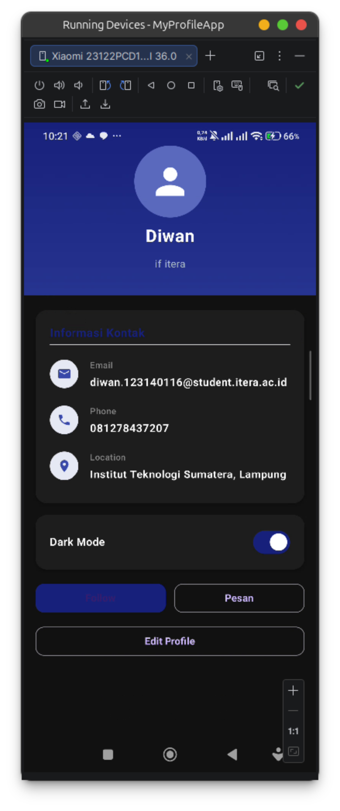

# Tugas Praktikum Minggu 4 — My Profile App

**Nama:** Diwan Ramadhani Dwi Putra  
**NIM:** 123140116  
**Mata Kuliah:** Pengembangan Aplikasi Mobile (IF25-22017)

## Deskripsi
Pengembangan dari tugas minggu 3. Aplikasi profil sederhana menggunakan Jetpack Compose dengan penambahan MVVM architecture pattern, fitur edit profil, dan dark mode toggle.

## Fitur
- ProfileHeader: foto profil circular + nama + bio
- InfoItem: reusable row untuk informasi kontak
- ProfileCard: card berisi list informasi (Email, Phone, Lokasi)
- Tombol Follow interaktif
- **[Baru]** Edit Profile: form untuk mengubah nama dan bio
- **[Baru]** Dark Mode Toggle: switch dark/light mode yang tersimpan di ViewModel
- **[Baru]** MVVM Pattern: state dikelola lewat ProfileViewModel dengan StateFlow

## Screenshot

## Composable Functions
1. `ProfileHeader` — header dengan foto, nama & bio
2. `InfoItem` — item informasi reusable
3. `ProfileCard` — card container informasi kontak
4. `EditTextField` — stateless TextField dengan state hoisting
5. `EditProfileScreen` — form edit nama dan bio
6. `ProfileScreen` — screen utama, connect ke ViewModel

## Arsitektur MVVM
- **Model** — `ProfileUiState` (data class di `data/ProfileData.kt`)
- **View** — `ProfileScreen`, `EditProfileScreen` (Composable functions)
- **ViewModel** — `ProfileViewModel` (mengelola state dengan `StateFlow`)
